# 📋 Documentação do Sistema Whatsale

> Sistema completo de atendimento WhatsApp, CRM e automações para empresas.

---

## 📑 Índice

1. [Visão Geral da Arquitetura](#-visão-geral-da-arquitetura)
2. [Módulos do Sistema](#-módulos-do-sistema)
3. [Diagramas de Arquitetura](#-diagramas-de-arquitetura)
4. [Modelo de Dados (ER)](#-modelo-de-dados-er)
5. [Fluxos de Processo](#-fluxos-de-processo)
6. [Variáveis do Sistema](#-variáveis-do-sistema)
7. [Infraestrutura](#-infraestrutura)

---

## 🏗 Visão Geral da Arquitetura

### Stack Tecnológico

| Camada | Tecnologia |
|--------|------------|
| **Frontend** | React 18 + Vite + TypeScript |
| **UI** | Tailwind CSS + shadcn/ui + Radix UI |
| **Estado** | TanStack Query (React Query) |
| **Backend** | Node.js + Express |
| **Banco de Dados** | PostgreSQL |
| **Autenticação** | JWT |
| **WhatsApp** | Evolution API / W-API |
| **Deploy** | Nginx + Easypanel |

### Arquitetura de Rede

```
┌─────────────────┐     ┌─────────────────┐     ┌─────────────────┐
│   Cliente Web   │────▶│  Nginx (Proxy)  │────▶│ Backend :3001   │
│   (React PWA)   │     │   /api/ /uploads│     │   (Node.js)     │
└─────────────────┘     └─────────────────┘     └─────────────────┘
                                                        │
                        ┌───────────────────────────────┼───────────────────────────────┐
                        │                               │                               │
                        ▼                               ▼                               ▼
                ┌───────────────┐             ┌─────────────────┐             ┌─────────────────┐
                │  PostgreSQL   │             │  Evolution API  │             │     W-API       │
                │   Database    │             │   (WhatsApp)    │             │   (WhatsApp)    │
                └───────────────┘             └─────────────────┘             └─────────────────┘
```

---

## 📦 Módulos do Sistema

### 🔐 Autenticação e Usuários
- Login/Logout com sessão persistente (JWT)
- Hierarquia de cargos: **Owner** > **Admin** > **Manager** > **Sales** / **Agent**
- Multi-tenancy com organizações isoladas
- Superadmin para gestão global do SaaS

### 💬 Chat (WhatsApp)
- Interface estilo WhatsApp Web
- Suporte a mídias: texto, imagem, áudio (waveform), vídeo, documentos
- Busca global em todas as conversas
- Emoji picker integrado
- @Menções para membros da equipe
- Notas internas por conversa
- Tags para organização e filtros
- Respostas rápidas com atalhos
- Agendamento de mensagens
- Iniciar fluxo de automação manualmente
- Transcrição de áudio (Whisper AI)
- Gravação de áudio nativa
- Painel lateral CRM integrado

### 📊 CRM

#### Negociações (Kanban)
- Drag-and-drop fluido entre etapas
- Indicadores visuais (bordas coloridas por status)
- Contador de tarefas pendentes
- Alertas de inatividade
- Estados: **Aberto**, **Ganho**, **Perdido**, **Pausado**
- Motivos de perda obrigatórios e configuráveis

#### Empresas
- Segmentos coloridos personalizáveis
- Múltiplos contatos por empresa
- Contato primário definível
- Importação em massa via Excel/CSV

#### Prospects
- Importação Excel/CSV com mapeamento dinâmico
- Campos personalizados (JSONB)
- Conversão individual ou em massa para Negociação + Empresa
- Flag `is_company` para identificar empresas

#### Tarefas
- Tipos personalizáveis (Ligação, Reunião, Email, etc.)
- Vinculação a negociações
- Agendamento com data/hora
- Sincronização com Google Calendar

#### Agenda Global
- Visualização unificada de reuniões e tarefas
- Integração Google Calendar OAuth 2.0
- Criação de Google Meet com participantes

#### Funis e Etapas
- Múltiplos funis configuráveis
- Reordenação de etapas via drag-and-drop
- Estatísticas por funil (quantidade e valor)

#### Automação de Funil
- Fluxos vinculados a etapas
- Movimentação automática por inatividade
- Pausa automática ao receber mensagem do contato

#### Grupos de Usuários
- Gestão de membros e supervisores
- Controle de visibilidade de dados por grupo

### 📢 Campanhas
- Seleção de múltiplas mensagens (envio aleatório)
- Delay configurável entre envios (mínimo 5 segundos)
- Variáveis dinâmicas: `{nome}`, `{telefone}`, `{email}`
- Disparo por **Fluxo de Automação**
- Agendamento com data/hora e janela de envio
- Seleção de contatos por tags ou listas

### 🤖 Chatbots

#### Modos Disponíveis
| Modo | Descrição |
|------|-----------|
| **Tradicional (IVR)** | Menus numerados para transferências e tags |
| **Flow (Visual)** | Editor drag-and-drop com árvore visual |
| **IA** | Respostas com inteligência artificial |
| **Híbrido** | Combinação de modos |

#### Permissões
- Vinculação a departamentos específicos
- Acesso controlado por cargo

### 🔄 Fluxos (Automações Visuais)

#### Tipos de Nós

| Categoria | Nó | Descrição |
|-----------|-----|-----------|
| **Mensagem** | Texto | Envia mensagem de texto |
| | Imagem | Envia imagem com legenda opcional |
| | Vídeo | Envia vídeo com legenda opcional |
| | Áudio | Envia arquivo de áudio |
| | Documento | Envia PDF, DOC, etc. |
| | Galeria | Envia múltiplas imagens em sequência |
| **Interação** | Menu | Opções numeradas para escolha |
| | Input | Coleta dados (aguarda resposta) |
| **Lógica** | Condição | Lógica condicional com variáveis |
| | Delay | Espera segundos, minutos ou horas |
| **Ação** | Adicionar Tag | Marca a conversa com tag |
| | Enviar E-mail | Envia email via SMTP |
| | Notificação Interna | Alerta para equipe |
| | Notificação Externa | WhatsApp para número externo |
| | Atualizar CRM | Modifica dados de negociação |
| **Roteamento** | Transferência | Move para departamento/agente |
| **Inteligência** | Resposta IA | Resposta com IA generativa |
| **Integração** | Webhook | Chamada HTTP externa |

#### Logs de Execução
- Rastreamento de transições entre nós
- Captura de variáveis em tempo real
- Estados de espera por resposta

### 💰 Cobrança (Asaas)

#### Sincronização Automática
| Horário | Ação |
|---------|------|
| 02:00 | Sync de pagamentos vencendo/atrasados |
| 08:00 | Verificação de status de pendentes |

- Sync manual disponível via interface
- Verificação de pagamentos pendentes (até 90 dias)
- Recuperação automática de nomes de clientes
- Retenção de dados: últimos 5 dias de atraso

#### Regras de Notificação
| Tipo | Descrição |
|------|-----------|
| **Antes do vencimento** | Lembrete preventivo |
| **No vencimento** | Aviso no dia |
| **Após vencimento** | Cobrança (range de dias) |

Templates com variáveis: `{nome}`, `{valor}`, `{vencimento}`, `{link}`, `{boleto}`, `{pix}`, `{descricao}`

#### Fila de Envio
- Geração de batches estáticos
- Intervalos fixos ou aleatórios
- Estimativa de término por lote
- Preview de 7 dias

#### Controles Avançados
- Blacklist de clientes
- Limite diário de mensagens por cliente
- Pausa global ou individual
- Alertas de inadimplência crítica
- Dashboard com taxas de recuperação
- Exportação Excel de relatórios

### 📧 E-mail (SMTP)

#### Configuração
- SMTP por organização ou usuário (override)
- Suporte TLS/SSL e STARTTLS
- Verificação de conexão com teste

#### Templates
| Categoria | Uso |
|-----------|-----|
| Geral | Comunicações genéricas |
| CRM | Acompanhamento de negociações |
| Campanhas | Email marketing |
| Fluxos | Automações |

Variáveis disponíveis: `{nome}`, `{email}`, `{telefone}`, `{empresa}`, `{deal_title}`, `{valor}`, `{etapa}`, `{funil}`, `{data}`

#### Pontos de Envio
- CRM (detalhe da negociação)
- Chat (painel lateral)
- Fluxos (nó de ação)
- Campanhas

### 🔌 Conexões (WhatsApp)

#### Providers Suportados
| Provider | Características |
|----------|-----------------|
| **Evolution API** | Open-source, self-hosted |
| **W-API** | SaaS, disparo resiliente |

#### Funcionalidades
- QR Code para conexão
- Status em tempo real
- Webhook diagnóstico
- Mensagem de teste
- Múltiplas instâncias por organização

### 🏢 Departamentos (Filas)
- Criação e gestão de departamentos
- Cores personalizadas para identificação
- Vinculação de agentes (múltiplos departamentos)
- Fila de atendimento por departamento
- Transferência manual ou automática

### ⚙️ Configurações

#### Organização
- Módulos habilitados (Chat, CRM, Campanhas, etc.)
- Branding (logo, ícone)

#### CRM
- Tipos de tarefas
- Segmentos de empresas
- Motivos de perda
- Campos personalizados

#### E-mail
- SMTP (organização/usuário)
- Templates

#### Notificações
- Múltiplos sons disponíveis
- Volume configurável

### 👑 Admin (Superadmin)
- Gestão de todas as organizações
- Planos SaaS com módulos toggleáveis
- Branding global do sistema
- Visão de todas as conexões
- Criação de organização + owner simultânea

### 📅 Agendamentos
- Mensagens agendadas por conversa
- Visualização em calendário
- Edição e cancelamento

### 📍 Mapa
- Visualização geográfica de contatos/prospects
- Integração Leaflet

### 🏷️ Tags
- Criação e gestão
- Cores personalizadas
- Aplicação em contatos/conversas
- Filtros instantâneos
- Integração com Fluxos e Campanhas

### 📱 PWA
- Instalável em dispositivos móveis
- Notificações push
- Modo offline básico
- Gestos swipe no mobile

---

## 🔷 Diagramas de Arquitetura

### Arquitetura Geral

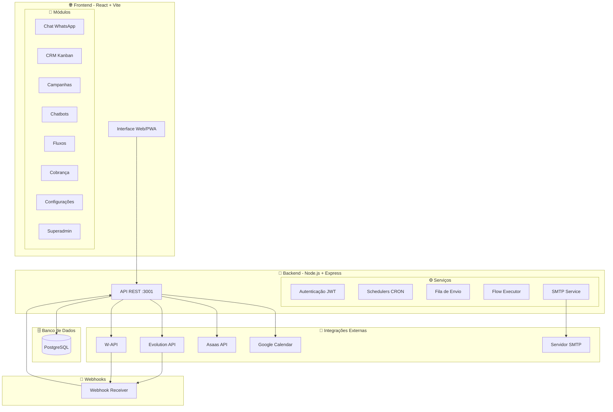

### Hierarquia de Acesso

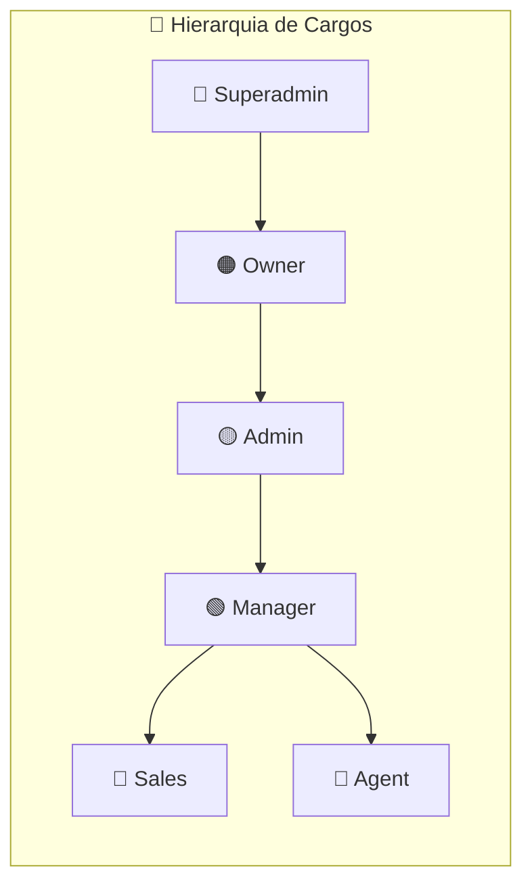

---

## 📊 Modelo de Dados (ER)

### Core - Usuários e Organizações

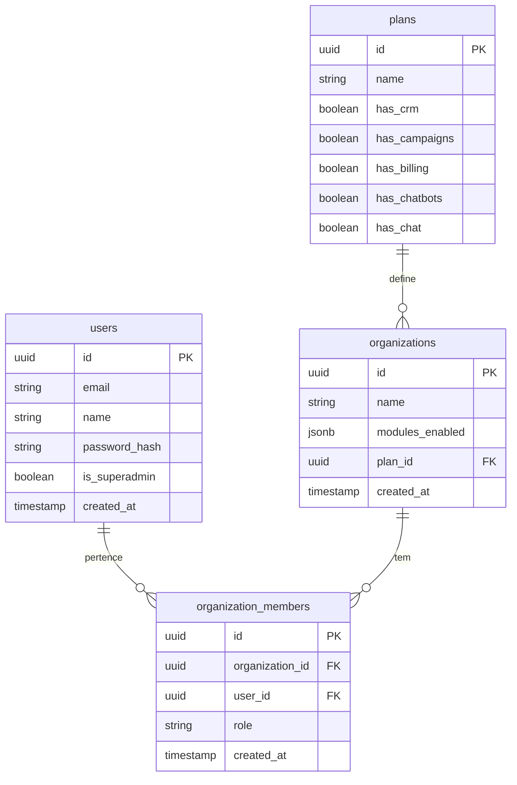

### WhatsApp - Conversas e Mensagens

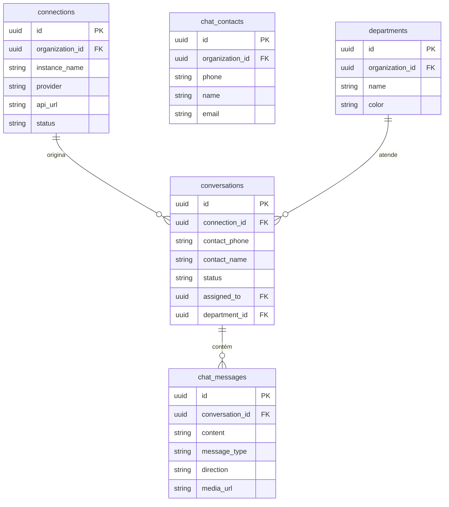

### CRM - Negociações e Empresas

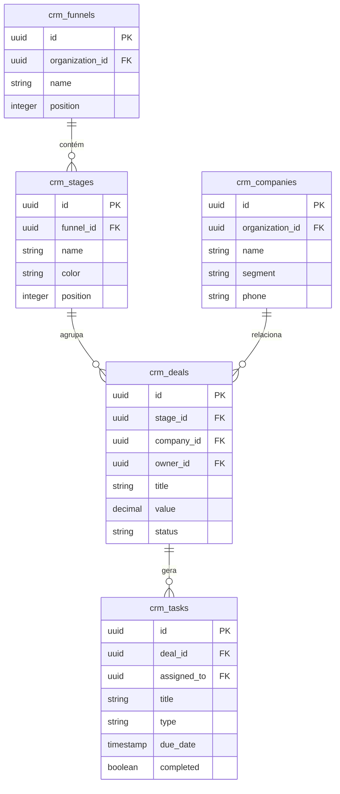

### Automações - Fluxos e Chatbots

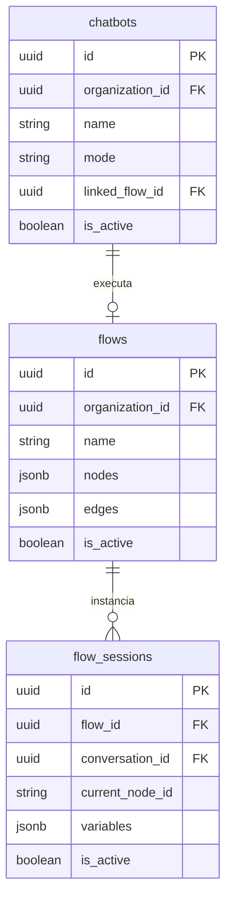

### Cobrança - Asaas

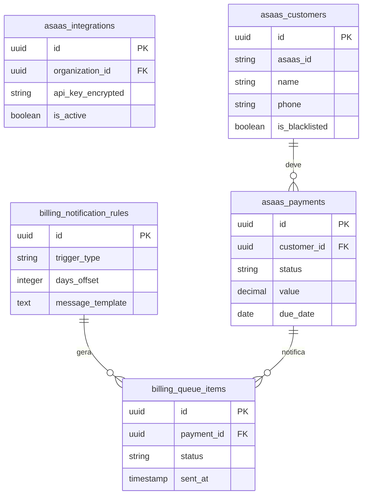

---

## 🔄 Fluxos de Processo

### Fluxo de Mensagem WhatsApp

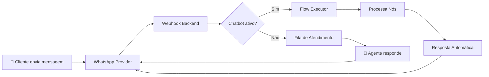

### Fluxo de Cobrança Asaas

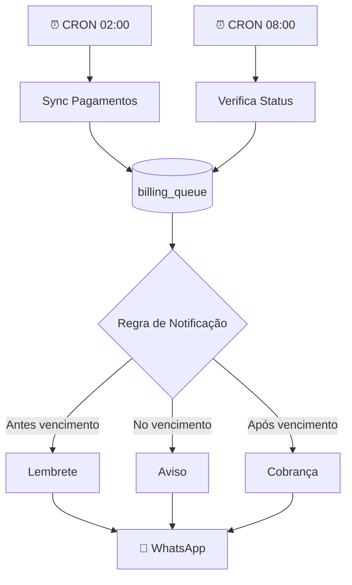

### Ciclo de Vida de Atendimento

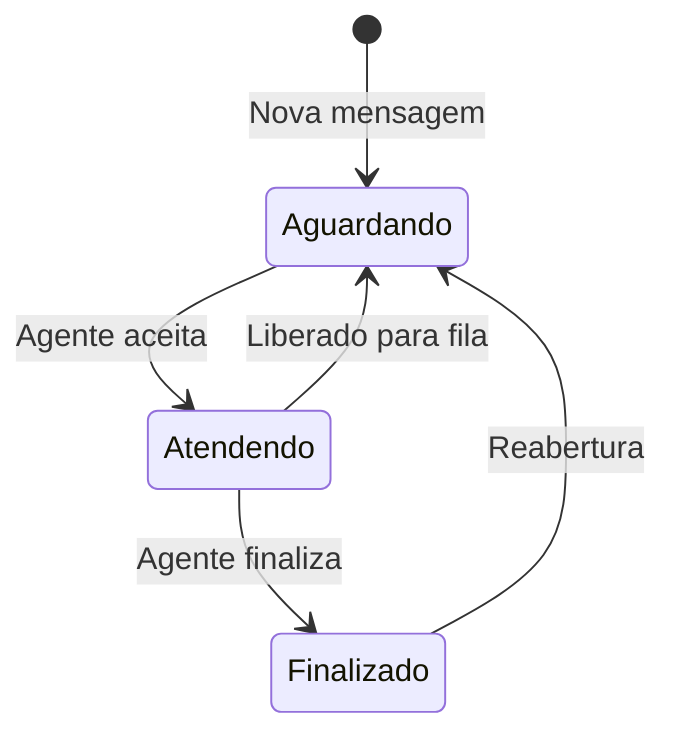

### Ciclo de Vida de Negociação (CRM)

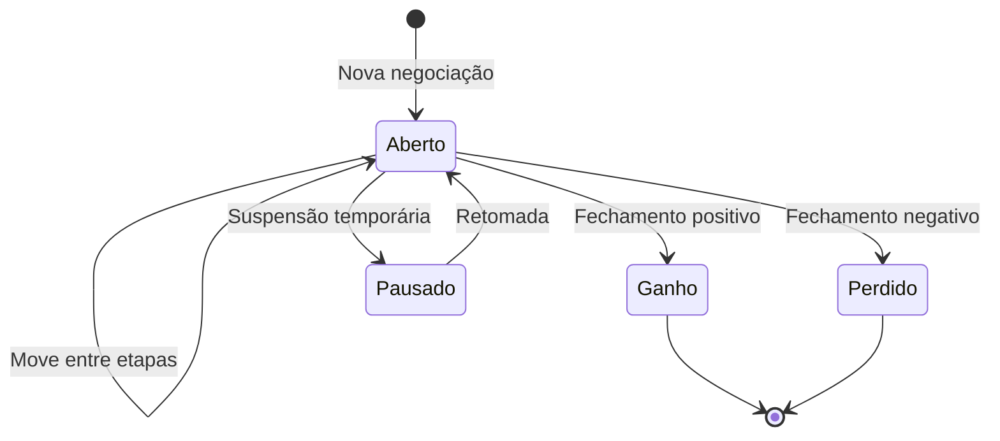

---

## 🔤 Variáveis do Sistema

### Sintaxe Unificada

O sistema utiliza a sintaxe `{variavel}` (chaves simples) em todos os módulos.

### Variáveis por Contexto

| Contexto | Variáveis Disponíveis |
|----------|----------------------|
| **Fluxos** | `{nome}`, `{telefone}`, `{email}`, `{mensagem}` |
| **Campanhas** | `{nome}`, `{telefone}`, `{email}` |
| **Email Templates** | `{nome}`, `{email}`, `{telefone}`, `{empresa}`, `{deal_title}`, `{valor}`, `{etapa}`, `{funil}`, `{data}` |
| **Cobrança Asaas** | `{nome}`, `{valor}`, `{vencimento}`, `{link}`, `{boleto}`, `{pix}`, `{descricao}` |
| **Respostas Rápidas** | `{nome}` |

---

## 🖥 Infraestrutura

### Variáveis de Ambiente (Backend)

| Variável | Descrição |
|----------|-----------|
| `DATABASE_URL` | String de conexão PostgreSQL |
| `JWT_SECRET` | Chave secreta para tokens JWT |
| `WEBHOOK_BASE_URL` | URL base para webhooks |
| `EMAIL_ENCRYPTION_KEY` | Chave para criptografia de senhas SMTP |

### Portas

| Serviço | Porta |
|---------|-------|
| Frontend (Nginx) | 80/443 |
| Backend (Node.js) | 3001 |
| PostgreSQL | 5432 |

### Proxy Reverso (Nginx)

```nginx
location /api/ {
    proxy_pass http://backend:3001/api/;
    proxy_ssl_server_name on;
}

location /uploads/ {
    proxy_pass http://backend:3001/uploads/;
}
```

### Resiliência de Migrações

O sistema possui tratamento de erros para tabelas/colunas ausentes:
- Código `42P01`: Tabela inexistente → retorna `[]`
- Código `42703`: Coluna inexistente → retorna `503`

---

## 📝 Changelog

| Data | Versão | Alterações |
|------|--------|------------|
| 2025-01-31 | 1.0 | Documentação inicial |

---

> **Whatsale** - Sistema de Atendimento WhatsApp & CRM
